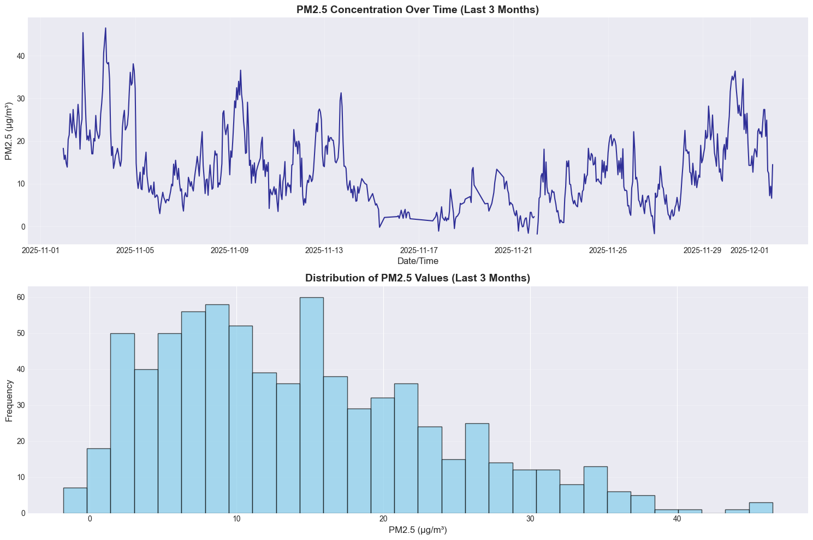
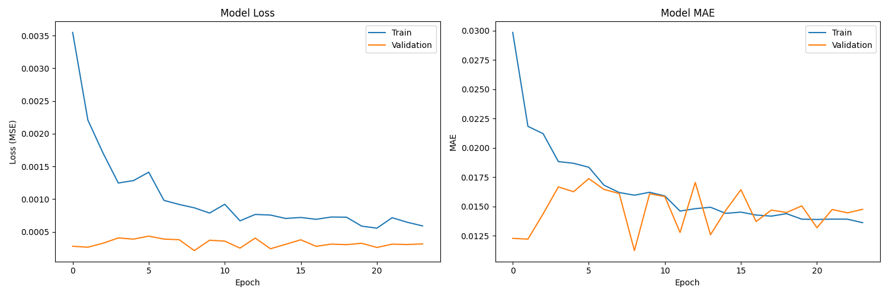

Name: Sophie Lam  
12 December 2025  

# Project Report: Urban Air Quality Predictor

## 1. Overview

Air quality monitoring and forecasting are critical for public health, urban planning, and environmental policy. PM2.5 (particulate matter with diameter ≤ 2.5 micrometers) is a key indicator of air pollution, capable of penetrating deep into the respiratory system and causing serious health effects.

This project develops an LSTM-based neural network for hourly PM2.5 (fine particulate matter) prediction in the Sydney urban area. The system ingests six months of air quality measurements and meteorological data, processes and validates the data pipeline, and trains a deep learning model for short-term air quality forecasting.

## Data Collection

### Data Sources

#### 1. OpenAQ API v3 - Air Quality Data

OpenAQ provides open-access air quality data from government-operated monitoring stations worldwide.

**Collected Parameters:**

| Parameter | ID | Units | Purpose | Sensor ID |
|-----------|-----|-------|---------|-----------|
| PM2.5 | 2 | µg/m³ | Target variable | 21610 |
| PM10 | 1 | µg/m³ | Strong predictor | 4805 |
| NO₂ | 7 | ppm | Traffic pollution indicator | 4810 |
| SO₂ | 9 | ppm | Industrial source indicator | 4807 |
| CO | 8 | ppm | Combustion indicator | 4820 |
| O₃ | 10 | ppm | Atmospheric chemistry | 728 |

#### 2. Open-Meteo API - Weather Data

Open-Meteo provides free historical and forecast weather data without API key requirements.

**Collected Variables:**

| Category | Variables |
|----------|-----------|
| **Temperature** | temperature_2m, dew_point_2m, apparent_temperature |
| **Humidity** | relative_humidity_2m |
| **Precipitation** | precipitation, rain |
| **Pressure** | pressure_msl, surface_pressure |
| **Wind** | wind_speed_10m, wind_direction_10m, wind_gusts_10m |
| **Other** | cloud_cover, is_day, sunshine_duration |

### Data Quality Report Summary

#### Pollutant Data

| Metric | Value |
|--------|-------|
| Total Records | 4,938 |
| Columns | 7 |
| Duplicate Timestamps | 611 |
| Hourly Gaps | 638 |

**Missing Value Rates:**

| Parameter | Missing % |
|-----------|-----------|
| datetime | 0.00% |
| PM2.5 | 2.88% |
| PM10 | 0.77% |
| NO₂ | 2.47% |
| SO₂ | 2.55% |
| CO | 3.24% |
| O₃ | 1.96% |

#### Weather Data

| Metric | Value |
|--------|-------|
| Total Records | 4,416 |
| Columns | 15 |
| Duplicate Timestamps | 0 |
| Hourly Gaps | 0 |
| Missing Values | None |

#### Merged Dataset

| Metric | Value |
|--------|-------|
| **Final Records** | 4,931 |
| **Total Features** | 21 |
| **Date Range** | 2025-06-01 07:00 UTC to 2025-12-01 23:00 UTC |

### Missing Data Handling Strategy

1. **Linear Interpolation**: Applied on time index for small gaps (< 3.3%)
2. **Forward/Backward Fill**: Used for edge cases
3. **Result**: Zero null values in processed dataset
### PM2.5 Time Series

*Figure 1: PM2.5 concentration over the last month of the study period.* This chart displays the hourly PM2.5 values, revealing daily cyclic patterns typical of urban air pollution—concentrations tend to rise during morning and evening rush hours due to increased traffic and fall overnight. The visible day-to-day variability reflects weather influences (wind dispersing pollutants, rain washing particles from the air) and weekly patterns (lower pollution on weekends).

### Feature Correlations

*Figure 2: Correlation matrix showing relationships between all 21 features.* Key observations:
- **PM10 has the strongest correlation with PM2.5 (0.87)**, which is expected since both measure particulate matter from similar sources
- **CO, NO₂, and SO₂ show moderate positive correlations** with PM2.5, indicating shared emission sources (vehicles, industry)
- **Wind speed shows negative correlation**—higher winds disperse pollutants, reducing PM2.5 concentrations
- **Temperature and humidity** have complex relationships with PM2.5 due to atmospheric chemistry effects

## 3. Model

### Why LSTM?

Long Short-Term Memory (LSTM) networks are a type of recurrent neural network (RNN) specifically designed for sequential data. They excel at air quality prediction because:

1. **Temporal dependencies**: Air pollution at any hour depends on conditions from previous hours—LSTM's memory cells capture these temporal patterns
2. **Long-range patterns**: Unlike standard RNNs, LSTMs can learn relationships spanning many time steps (e.g., pollution buildup over 24 hours)
3. **Non-linear relationships**: LSTMs model complex interactions between weather, traffic patterns, and pollution that linear models cannot capture

### Model Architecture

**Architecture:** Long Short-Term Memory (LSTM)

- **Input**: 24-hour lookback window × 24 features (the model "sees" the last 24 hours to predict the next hour)
- **LSTM(64)**: First LSTM layer with 64 hidden units learns complex temporal patterns
- **Dropout(0.2)**: Randomly drops 20% of connections during training to prevent overfitting
- **LSTM(32)**: Second LSTM layer with 32 units further refines temporal representations
- **Dense(32, ReLU)**: Fully connected layer transforms LSTM output for prediction
- **Dense(1)**: Output layer produces the single PM2.5 prediction
- **Optimizer**: Adam with learning rate 1e-3 (adaptive learning for stable convergence)
- **Loss**: Mean Squared Error (penalizes large prediction errors)
- **Total Parameters**: ~36,000 trainable weights

### Training Progress

*Figure 3: Training and validation loss over epochs.* The decreasing curves show the model is learning. The gap between training and validation loss indicates some overfitting—the model fits training data better than held-out validation data. Early stopping (patience=15) prevented excessive overfitting by stopping training when validation loss stopped improving.

## 4. Results and Conclusion

| Metric | Training | Test |
|--------|----------|------|
| **MAE** | 3.41 µg/m³ | 5.93 µg/m³ |
| **RMSE** | 5.88 µg/m³ | 8.09 µg/m³ |
| **R²** | 0.74 | 0.17 |

- **MAE (Mean Absolute Error)**: Average prediction error in µg/m³. Training MAE of 3.48 means predictions are off by ~3.5 units on average.
- **RMSE (Root Mean Squared Error)**: Penalizes larger errors more heavily. Higher RMSE indicates some predictions have significant errors.
- **R² (Coefficient of Determination)**: Measures how much variance the model explains. Training R²=0.78 means 78% of PM2.5 variation is captured; negative test R² indicates the model performs worse than simply predicting the mean.

### Actual vs Predicted

*Figure 4: Comparison of actual PM2.5 values (blue) vs model predictions (orange) for both training and test sets.* The training plot shows predictions closely tracking actual values. The test plot reveals a generalization gap—the model struggles to capture the full variability of unseen data, often predicting values closer to the mean.

### 24-Hour Forecast

*Figure 5: 24-hour ahead forecast using the most recent data.* The chart overlays the predicted next 24 hours (orange) on top of the last 72 hours of actual data (blue). The forecast predicts stable PM2.5 values around 6.6–7.2 µg/m³, which falls in the "Good" air quality category according to EPA standards.

### Conclusion

The LSTM model successfully learns temporal patterns in the training data (R² = 0.74), demonstrating that air quality prediction using deep learning is feasible. However, the gap on test data (R² = 0.17) indicates challenges with generalization—possibly due to:
- Seasonal or event-based pollution patterns not seen in training
- Limited six-month training window
- Need for additional features (traffic data, fire events, etc.)

Future work could explore longer training periods, transformer architectures, or ensemble methods to improve generalization.